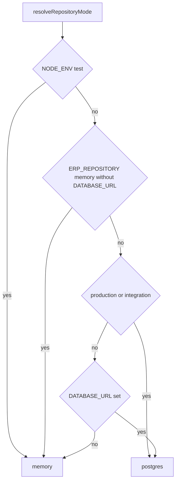

# Persistenz und Repository-Modus (Memory vs. Postgres)

**Kanonische Implementierung:** [`src/config/repository-mode.ts`](../../src/config/repository-mode.ts) (`resolveRepositoryMode`, `assertDatabaseUrlForPostgresMode`). **Adapter-Wahl und Write-Through:** [`src/api/app.ts`](../../src/api/app.ts) (`buildApp` — Verzweigung nach `repositoryMode`).

**ADR:** [ADR-0003](../adr/0003-persistence-spike.md). Ergänzend: README-Abschnitt [Hinweis zur Persistenz](../../README.md) (Persistenz-Slices, kein Ersatz für diese Seite).

---

## Laufzeitbild (kurz)

- **In-Memory-Repositories** (`src/repositories/in-memory-repositories.ts`) halten den **SoT im Prozess** für die Domänenlogik.
- **Postgres** (Prisma, `src/persistence/*`) dient als **Abbild / Write-Through** für die im README genannten Slices — nicht jedes Aggregat ist in jedem Modus identisch persistiert; bei Unklarheit README-Abschnitt „Hinweis zur Persistenz“ und passende ADRs lesen.

---

## Entscheidung: welcher Modus?

Reihenfolge entspricht der Logik in `resolveRepositoryMode` (Vereinfachung für Leser):

1. Expliziter Aufruf `buildApp({ repositoryMode: "memory" | "postgres" })` setzt den Modus.
2. **`NODE_ENV === "test"`** → immer **memory** (Tests).
3. **`ERP_REPOSITORY === "memory"`** und **keine** `DATABASE_URL` → **memory** (explizite Memory-Demo). *Hinweis:* Mit gesetzter `DATABASE_URL` allein reicht `ERP_REPOSITORY=memory` nicht — URL entfernen oder `repositoryMode: "memory"` im Test/App-Builder setzen (Kommentar in `repository-mode.ts`).
4. **`NODE_ENV === "production"`** oder **`ERP_DEPLOYMENT === "integration"`** → **postgres** (Deployment erwartet DB).
5. **`DATABASE_URL`** gesetzt (nicht leer) → **postgres** (typischer Dev-Alltag mit lokaler DB).
6. Sonst → **memory** (schneller Demo-Start ohne DB).

---

## Typische Verwirrung („warum sehe ich X nicht in Postgres?“)

- Ihr lauft **memory**, obwohl ihr glaubt, Postgres zu nutzen — z. B. `DATABASE_URL` nicht gesetzt oder Test-Modus.
- Ihr habt **Postgres**, aber nur bestimmte **Slices** sind angebunden — siehe README „Hinweis zur Persistenz“ und ADRs zum jeweiligen Aggregat.
- **`ERP_REPOSITORY=memory` mit gesetzter `DATABASE_URL`:** Modus wird **postgres** (Schutz vor stiller Überschreibung durch alte `.env`); für striktes Memory Tests/`buildApp` nutzen.

---

## Wo im Code nachsehen

| Thema | Ort |
|--------|-----|
| Modus auflösen | `src/config/repository-mode.ts` |
| Prisma-Client, `Prisma*Persistence`, Seeds | `src/api/app.ts` (`buildApp`, Zweig `repositoryMode === "postgres"`) |
| In-Memory-SoT | `src/repositories/in-memory-repositories.ts` |
