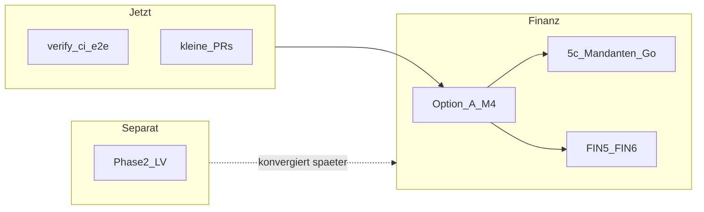

# Roadmap: Weg zur fertigen App

**Stand:** konsolidiert mit [nächste-schritte.md](./nächste-schritte.md), [MVP-FINANZ-PHASEN-UND-ARBEITSPLAN.md](../MVP-FINANZ-PHASEN-UND-ARBEITSPLAN.md), [NEXT-INCREMENT-FINANCE-WAVE3.md](../tickets/NEXT-INCREMENT-FINANCE-WAVE3.md). Mandanten-Go ist **nicht** durch dieses Repo verpflichtend abgebildet.

## Zielbild

„Fertig“ ist im Repo dreigeteilt:

1. **Technische Lieferfähigkeit:** grünes CI (`backend`, `e2e-smoke`), kleine PRs, Verträge synchron ([nächste-schritte.md](./nächste-schritte.md), [AGENTS.md](../../AGENTS.md)).
2. **Finanz-MVP v1.3:** Phasen FIN-0–FIN-6 laut [MVP-FINANZ-PHASEN-UND-ARBEITSPLAN.md](../MVP-FINANZ-PHASEN-UND-ARBEITSPLAN.md); derzeit Schwerpunkt **Finanz Welle 3 / Option A** ([NEXT-INCREMENT-FINANCE-WAVE3.md](../tickets/NEXT-INCREMENT-FINANCE-WAVE3.md)).
3. **Mandanten-Produktiv-Go (extern):** operative Bewertung außerhalb des Repo-Prozesses; optionaler Kontext: Archiv [`docs/_archiv/checklisten-compliance-human-workflow/README.md`](../docs/_archiv/checklisten-compliance-human-workflow/README.md), Stub [`Checklisten/compliance-rechnung-finanz.md`](../../Checklisten/compliance-rechnung-finanz.md); Agenda [m4-slice-5c-pl-mandanten-go.md](../runbooks/m4-slice-5c-pl-mandanten-go.md).

## Phase A — Lieferdisziplin (fortlaufend)

- Vor jedem Merge: `npm run verify:ci`; bei Persistenz/OpenAPI/Finanz-Schema: `npm run verify:ci:local-db` ([ci-and-persistence-tests.md](../runbook/ci-and-persistence-tests.md)).
- Vor Merge auf `main`: `npm run verify:pre-merge` ([AGENTS.md](../../AGENTS.md)).
- PR-Head: **`backend`** + **`e2e-smoke`**; §5a / Review: [qa-fin-0-gate-readiness.md](../contracts/qa-fin-0-gate-readiness.md), [review-checklist-finanz-pr.md](../contracts/review-checklist-finanz-pr.md).
- Agent-Checkliste: [PL-WAVE3-M4-NEXT-BRANCH-RECORD-2026-04-26.md](../tickets/PL-WAVE3-M4-NEXT-BRANCH-RECORD-2026-04-26.md) (*Agent-Abnahme*, **Wave3-14-Tool-Todos**); nach Merge kurze *Tempo*-Zeile in [nächste-schritte.md](./nächste-schritte.md) bzw. qualifizierte P1-3-Zeile nur mit echter PR-URL ([P1-3-DOCS-MILESTONE-WAVE3.md](../tickets/P1-3-DOCS-MILESTONE-WAVE3.md)).
- Touch von [api-contract.yaml](../api-contract.yaml) / `info.version`: [openapi-contract-version.ts](../../src/domain/openapi-contract-version.ts) und [FIN4-external-client-integration.md](../contracts/FIN4-external-client-integration.md) synchron halten.

## Phase B — Finanz Welle 3, Default Option A

**Aktuelle Spur (Repo-Doku):** Spur **A** (Option A / M4-Rest) — siehe [nächste-schritte.md](./nächste-schritte.md) Abschnitt *Nächste Produktspur*; bei Team-Wechsel nach B–E dort anpassen.

**Option vs. Spur (Lesen):** Im Ticket [NEXT-INCREMENT-FINANCE-WAVE3.md](../tickets/NEXT-INCREMENT-FINANCE-WAVE3.md) sind **Option A–D** (Tabelle) nicht dieselben Labels wie **Spur A–E** in [nächste-schritte.md](./nächste-schritte.md); kurz erklärt unter **Hinweis (Lesen)** direkt unter der Optionen-Tabelle — **Option B** = 8.4(2–6)-Motor, **Spur B** = FIN-5.

**Gewählt laut Ticket:** weiter [NEXT-INCREMENT-FINANCE-WAVE3.md](../tickets/NEXT-INCREMENT-FINANCE-WAVE3.md) — nach technischem M4-Kern (inkl. **5c**): optional kleine UX-/Shell-Follow-ups unter Spur **A**; strategisch **FIN-5** ([`MVP-FINANZ-PHASEN-UND-ARBEITSPLAN.md`](../MVP-FINANZ-PHASEN-UND-ARBEITSPLAN.md) Teil 3) mit Spur **B** in [nächste-schritte.md](./nächste-schritte.md), sobald §8.16/Fail-Closed geklärt ist; keine parallele Option **B/C** (8.4(2–6), Zwischenstatus) ohne dokumentiertes Gate.

**Konkret nächste Umsetzungsschritte (Auswahl im Team, jeweils eigener PR):**

- Rest-M4 / §8.10 gemäß Ticket („Nächster Strang“, Non-Goals beachten).
- Optional: weitere Playwright-Journeys [login-finance-smoke.spec.ts](../../e2e/login-finance-smoke.spec.ts).
- **Erledigt (Shell):** Invoice-Shell — `GET /finance/payment-terms`, `GET …/allowed-actions` (`INVOICE`), Memory-Seed FIN‑1, E2E — siehe [nächste-schritte.md](./nächste-schritte.md) Schritt 4 / „Nach Merge (optional Schritt 4 — Shell)“.
- **Erledigt (Shell, 2026-05-04):** Export-Preflight-Protokoll — `GET /exports`, `GET /exports/{exportRunId}` an der INVOICE-Shell ([App.tsx](../../apps/web/src/App.tsx), [api-client.ts](../../apps/web/src/lib/api-client.ts)); Persistenz `export_runs` — [CODEMAPS/overview.md](../CODEMAPS/overview.md).
- Optional: weitere Shell-read-only-`GET` nur nach OpenAPI + [api-client.ts](../../apps/web/src/lib/api-client.ts), getrennt von Schreibpfaden in [App.tsx](../../apps/web/src/App.tsx).

Mahn-IA/Routing: [FOLLOWUP-M4-DUNNING-UX-GRUNDEINSTELLUNGEN-TAB.md](../tickets/FOLLOWUP-M4-DUNNING-UX-GRUNDEINSTELLUNGEN-TAB.md) ist als erledigt dokumentiert — keine Pflicht-Arbeit aus diesem Ticket.

## Phase C — Mandanten-Go Massen-E-Mail (M4 Slice 5c)

- Technik im Repo; **Team-Entscheid:** produktiver Versand ja/nein, SMTP/Idempotenz-Betrieb.
- Vor Live: [compliance-rechnung-finanz.md](../../Checklisten/compliance-rechnung-finanz.md), Runbook [m4-slice-5c-pl-mandanten-go.md](../runbooks/m4-slice-5c-pl-mandanten-go.md), Spec [M4-BATCH-DUNNING-EMAIL-SPEC.md](../tickets/M4-BATCH-DUNNING-EMAIL-SPEC.md).

## Phase D — Finanz-MVP „komplett“ (nach Welle 3)

| Phase | Inhalt | Quelle |
|-------|--------|--------|
| **FIN-5** | Steuern und Sonderfälle (MVP-Subset) | [MVP-FINANZ-PHASEN-UND-ARBEITSPLAN.md](../MVP-FINANZ-PHASEN-UND-ARBEITSPLAN.md), Teil 3 |
| **FIN-6** | Härtung und Abnahme MVP (u. a. 8.14, 12, 15; optional Export-Skeleton) | dortselbst |
| **Audit / GoBD-Querschnitt** | eigenes Ticket, nicht mit Mahn-UI mischen | [FOLLOWUP-AUDIT-DB-PERSIST-FAIL-HARD.md](../tickets/FOLLOWUP-AUDIT-DB-PERSIST-FAIL-HARD.md) |

Umsetzung in **eigenen Tickets/PRs** nach Abschluss der gewählten Welle-3-Inkremente.

## Phase E — Gesamt-ERP / LV-Kette

- Phase 2 LV/Aufmass: [PHASE-2-PRIORISIERUNG-INCREMENT-2.md](../tickets/PHASE-2-PRIORISIERUNG-INCREMENT-2.md), [PHASE-2-STARTAUFTRAG.md](../tickets/PHASE-2-STARTAUFTRAG.md) — **nicht** mit Finanz-Welle 3 im selben PR vermischen.
- Später: Mandanten-Policies / erweiterte Rollen ([nächste-schritte.md](./nächste-schritte.md), *Danach in Aussicht*).

## Explizit nicht ohne dokumentiertes Gate

- 8.4(2–6)-Motor, Pfad C (Zwischenstatus Rechnung), B5 formales Mahn-PDF — [NEXT-INCREMENT-FINANCE-WAVE3.md](../tickets/NEXT-INCREMENT-FINANCE-WAVE3.md), [B5-SPEC-DELIVERY-BOUNDARY-WAVE3.md](../tickets/B5-SPEC-DELIVERY-BOUNDARY-WAVE3.md).

## Team-Entscheidung

Reihenfolge nach Phase B: weiter nur M4/UX, zügig FIN-5/FIN-6, oder Parallelstart Phase 2 mit eigenem Branch/Team — beeinflusst PR-Schnitt, nicht die kanonischen Qualitätsregeln.
