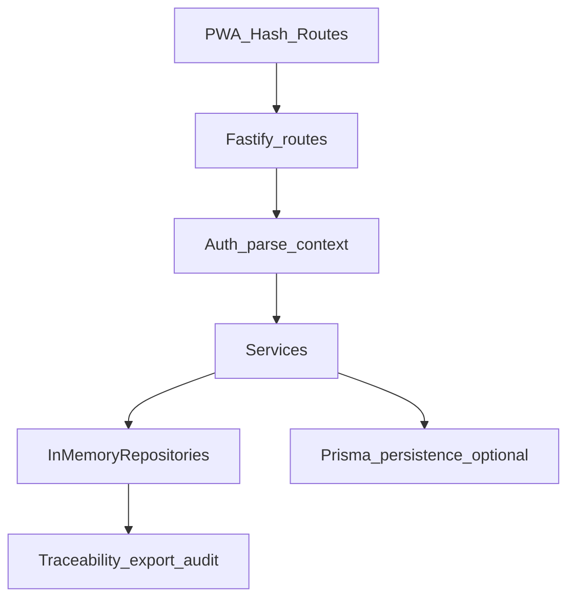

# Projektprüfung nach cursor-stack Skills

**Stand:** 2026-05-04 — Audit ergänzt nach Rebase/Push  
**Branch:** `feat/export-runs-shell-spur-a` — nach **`git rebase origin/main`** und Push zum Remote aktualisiert; aktuellen Commit siehe `git log -1` auf dem Branch (Inhalt: Cursor-Stack, Skill-Review, Export/LV-Deltas, Follow-up-Doku).  
**Projekt-Overrides:** [`.cursor/rules/cursor-stack.mdc`](../../.cursor/rules/cursor-stack.mdc) — `mainBranch: main`, `testCommand: npm run verify:ci`, `preMergeCommand: npm run verify:pre-merge`

Skills-Referenz: [`.cursor/skills/*/SKILL.md`](../../.cursor/skills/).

---

## 1. Researcher — Research Brief

### Was existiert (Ist-Landkarte)

- **Einstieg:** [`docs/CODEMAPS/overview.md`](../CODEMAPS/overview.md) — Fastify `src/api/app.ts`, Routen `*-routes.ts`, Services (`invoice-service`, `export-service`, Mahnwesen, LV/Hierarchy), Persistenz unter `src/persistence/`, PWA `apps/web`.
- **Verträge:** [`docs/api-contract.yaml`](../api-contract.yaml) (`info.version` synchron zu [`src/domain/openapi-contract-version.ts`](../../src/domain/openapi-contract-version.ts)), [`docs/contracts/error-codes.json`](../contracts/error-codes.json), FIN-4-Leitfaden [`docs/contracts/FIN4-external-client-integration.md`](../contracts/FIN4-external-client-integration.md).
- **Finanz-Spur:** Payment Intake (Idempotenz), Dunning (M4/SEMI), Export-Preflight (`export_runs`, `ExportService`), Shell-read-only GETs laut Codemap; Gates dokumentiert in [`docs/tickets/NEXT-INCREMENT-FINANCE-WAVE3.md`](../tickets/NEXT-INCREMENT-FINANCE-WAVE3.md), [`docs/tickets/FIN-2-NEXT-SUBPROJECT-GATE.md`](../tickets/FIN-2-NEXT-SUBPROJECT-GATE.md), FIN-5/FIN-6 Verweise in Plänen.
- **Auth / Mandant:** Bearer, Rollen in `AuthorizationService`, Repo-Zugriffe typischerweise `get*ByTenant`; PWA: [`apps/web/src/lib/tenant-session.ts`](../../apps/web/src/lib/tenant-session.ts) — sessionStorage für Token, kein Bearer in localStorage.
- **Cursor-Integration:** Kanonische Regel `cursor-stack.mdc`, Validator `npm run validate:cursor-project-rules`, Skills unter `.cursor/skills/`.

### TODO/FIXME in `src/**/*.ts`

- Keine Treffer auf `TODO|FIXME|HACK` (Stand Prüfung) — kein zusätzlicher Marker-Backlog aus dem Schnellscan.

### Zentrale Risiko-Pfade (für tiefere Reviews)

- Buchung / Traceability / Postgres-Sync (`invoice-service`, `traceability-service`, Persistenz).
- Zahlungseingang + Statusübergänge (`payment-intake-service`).
- Export-Preflight + Audit (`export-service`, `export-run-persistence`).
- Mandanten-Grenzen überall dort, wo IDs aus dem Client kommen (Routes + Services).

---

## 2. plan-ceo (HOLD SCOPE) — Produkt-Fit

**Modus:** HOLD — Scope nicht neu erfinden; Abgleich Dokumentation vs. kommunizierte Richtung.

- [`docs/ERP-Systembeschreibung.md`](../ERP-Systembeschreibung.md) (Teil 0): Mandantentrennung, Versionierung, Traceability, System-/Bearbeitungstext — **konsistent** mit implementierten Schwerpunkten (Finanz-Slices, LV Phase 2, Shell read-only).
- [`docs/plans/nächste-schritte.md`](../plans/nächste-schritte.md): Spur **A** als Default, klare **Non-Goals** (kein paralleles 8.4(2–6)/Pfad C ohne Gate), Merge-Disziplin `verify:pre-merge`, zweiter Statuscheck **e2e-smoke** — **passend** zur CI-/AGENTS-Realität.
- **Hinweis:** Branch kombiniert laut Historie/Doku mehrere Lieferstränge (Exportläufe, LV §9, Cursor-Stack, Web-Polish). Für **PR-Hygiene** empfiehlt die gleiche Datei weiterhin **thematisch getrennte PRs** — das ist ein **Prozessrisiko**, kein technischer Defekt.

**Offene strategische Produktentscheidung ( dokumentiert, nicht vom Audit zu schließen):** FIN-5 §8.16 vs. Fail-Closed ([`docs/tickets/FIN-5-GATE-816-FAIL-CLOSED.md`](../tickets/FIN-5-GATE-816-FAIL-CLOSED.md)) vor Spur **B**.

---

## 3. plan-eng — Architektur & Failure Modes

### Datenfluss (vereinfacht)

- **Postgres vs Memory:** Konfiguration über Repository-Modus; CI und Integrationspfade erzwingen Persistenz-Suites mit `PERSISTENCE_DB_TEST_URL` (Runbook).
- **Failure-Modes (repräsentativ):**
  - Idempotenz-Konflikt Zahlungseingang → Domain-Fehlercode dokumentiert im Service.
  - Rechnungsbuchung: Traceability assert fail-closed; Prisma Unique (`P2002`) abgefangen in `invoice-service`.
  - Export: Validierungsfehler sammeln, Entität fehlt → 404 `EXPORT_ENTITY_NOT_FOUND`.
  - Audit fail-hard: README/ADR/Followup-Tickets — weiterhin operationsrelevant bei Postgres.

### Komplexität / Gerüche

- Große Diff-Oberfläche Branch↔main (viele Docs + Finanz + LV + Cursor) — **erhöht Review-Aufwand**; technische Modularität der Schichten bleibt aber erkennbar (API → Service → Repo/Persistence).

### Rohe SQL-Stellen

- `$queryRaw` Readiness-Check in `app.ts`; `$executeRawUnsafe('SET CONSTRAINTS ALL DEFERRED')` in Offer-/LV-Mess-Persistenz — **kein** User-String-Einschub erkennbar; bei Änderungen dort weiterhin SQLi-Risiko im Blick behalten.

---

## 4. code-review (Paranoid Hotspots)

Auszug priorisiert nach SKILL-Kategorien (kein Voll-Repo-Review).

### Kritisch / Hoch (Überwachung, keine neuen Blocker aus diesem Audit)

- **Security / Trust boundary:** Services nutzen durchgängig `tenantId` aus verifiziertem Kontext bei Entitätszugriff (Beispiel `ExportService.prepareExport` + `getInvoiceByTenant`). **Empfehlung:** bei neuen Routen gleiches Muster erzwingen (kein „trusted“ client tenant header ohne Token-Binding).
- **Data integrity:** Fremdschlüssel und Transaktionen in Persistenz-Pfaden — weiterhin suite-abgesichert (`test/persistence.integration.test.ts`, `test/app.test.ts`).

### Mittel (Should fix / kontinuierlich)

- **Performance:** Bei neuen Listen-Endpunkten auf LIMIT/Pagination achten (Skill-Hinweis N+1/unbounded) — bestehende kritische Pfade nicht im Vollumfang vermessen in diesem Audit.
- **Observability:** Strukturierte Logs/Metriken für Finanz- und Export-Pfade optional ausbauen (Skill empfiehlt Observability für neue Pfade).

### Niedrig

- Keine auffälligen `TODO`-Marker in `src/` zum Zeitpunkt der Prüfung.

---

## 5. QA — Ergebnis

| Check | Ergebnis |
|--------|----------|
| `npm run verify:pre-merge` (= `verify:ci` + Playwright [`e2e/login-finance-smoke.spec.ts`](../../e2e/login-finance-smoke.spec.ts)) | **PASS** (initial und **erneut nach Rebase auf `origin/main`** am selben Tag), 13 E2E-Tests grün |
| Explorationsplan (Skill „Full exploration“) | **Nicht ausgeführt** — außerhalb Budget; empfohlen bei großen UI-Änderungen zusätzlich |

Merge-Evidenz-Vorlagen: [`docs/contracts/qa-fin-0-gate-readiness.md`](../contracts/qa-fin-0-gate-readiness.md).

---

## 6. ship — Pre-Ship Audit (Overrides)

| Checkliste (Ship-SKILL + Overrides) | Status |
|-------------------------------------|--------|
| Absichtliche Änderungen / kein Debug-Müll im geplanten Merge-Set | Zu prüfen im PR-Diff gegen `origin/main` — Branch enthält u. a. Cursor-Integration und Finanz/LV-Deltas |
| Keine Secrets im Diff | Kein Scan-Ersatz für Menschen; keine offensichtlichen Muster in Audit-Stichprobe |
| Tests: **`npm run verify:ci`** | **PASS** (Teil von verify:pre-merge) |
| Rebase-Ziel **`origin/main`** vor Merge | **Erledigt** (`git fetch` + `git rebase origin/main`); danach `verify:pre-merge` erneut grün |
| Push zum Remote | **Erledigt** — `origin/feat/export-runs-shell-spur-a` mit `--force-with-lease` aktualisiert (History nach Rebase) |

**PR/Merge** auf `main`: durch Menschen in GitHub; Evidence §5a siehe [`docs/contracts/qa-fin-0-gate-readiness.md`](../contracts/qa-fin-0-gate-readiness.md).

---

## 7. retro (optional, komprimiert)

- **`main` (30 Tage):** `git log --since="30 days ago" --oneline main` → **227** Commits.
- **Alle refs (30 Tage):** `git log --since="30 days ago" --oneline --all` → **304** Commits (inkl. Feature-Branches).
- **Hotspot-Dateien (Branch vs origin/main, grober Überblick aus `--stat`):** u. a. `docs/api-contract.yaml`, `test/persistence.integration.test.ts`, `src/api/app.ts`, `apps/web/src/App.tsx`, diverse `docs/plans`/`docs/tickets`, neue `.cursor/*`, Export-Service/Persistenz.

---

## Ergebnis & nächste Schritte

- **Technisch:** Vor-merge-Kette **`npm run verify:pre-merge`** ist nach Rebase **grün**; Projektregeln-Validator **grün**.
- **Prozess:** Branch-Inhalt ist **breit** — für Review-Barriere kleine, thematische PRs oder sehr diszipliniertes Mono-PR-Review laut [`docs/plans/nächste-schritte.md`](../plans/nächste-schritte.md).
- **Strategie (Team, nicht automatisierbar):** Vor Spur **B** / FIN-5-Implementierung die Entscheidung **§8.16 vs. Fail-Closed** dokumentiert festhalten ([`docs/tickets/FIN-5-GATE-816-FAIL-CLOSED.md`](../tickets/FIN-5-GATE-816-FAIL-CLOSED.md), ADR [`docs/adr/0014-fin5-mvp-tax-fail-closed.md`](../adr/0014-fin5-mvp-tax-fail-closed.md)); danach „Gewählte Spur“ in [`docs/plans/nächste-schritte.md`](../plans/nächste-schritte.md) anpassen.
- **QA optional:** Vollständige UI-Exploration (Skill „Full exploration“) bei großen PWA-Änderungen zusätzlich zum Smoke — nicht Teil dieses Follow-ups.

Fachliche/operative Punkte dieses Abschnitts ändern keinen Anwendungscode; der Follow-up-Rebase/Push war rein lieferkettenbezogen.
